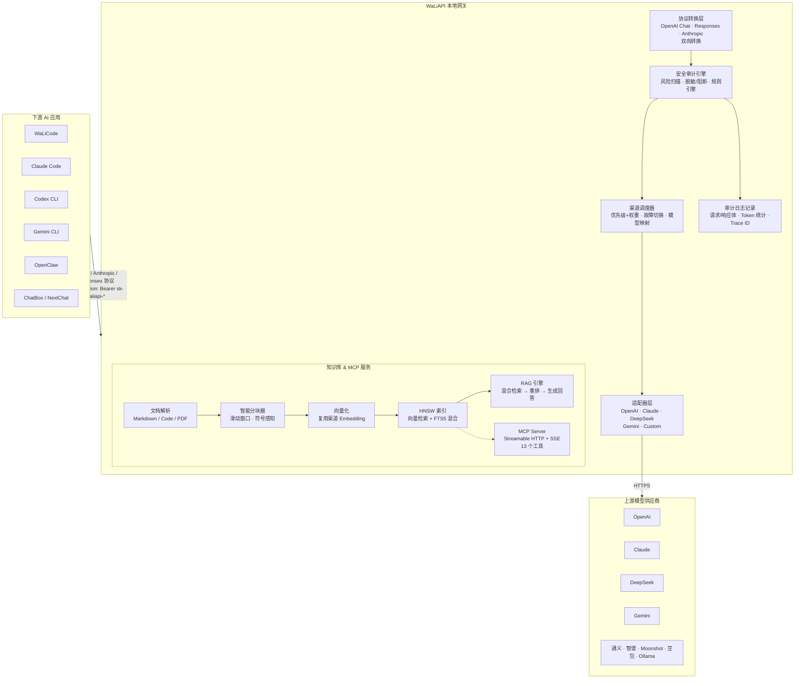
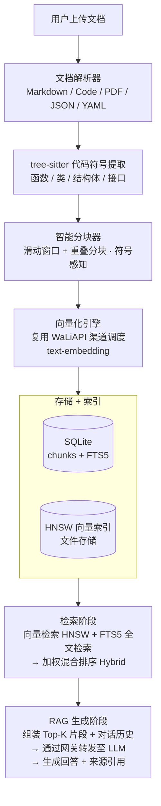
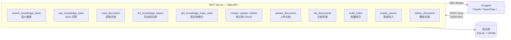

<div align="center">

# WaLiAPI

### 本地 LLM API 网关 · 多协议接入 · 知识库 RAG · MCP 工具服务

[](./src-tauri/tauri.conf.json)
[](./LICENSE)
[](#-安装使用)
[](https://tauri.app)

</div>

> **WaLiAPI** 是一款本地运行的 LLM API 网关桌面软件。它将多个上游模型供应商（OpenAI、Claude、DeepSeek、Gemini……）统一为 OpenAI 兼容协议，配合 [WaLiCode](https://walicode.xiaofuge.cn/)、Codex、Claude Code、Gemini CLI、OpenClaw 等 AI 编程工具使用，让你清楚知道 AI 对话到底在说什么。

⭐️ 推荐 LLM 套餐(Kimi K3)：[https://mp.weixin.qq.com/s/jb2YzxFLNhIhjW5EONLcDA](https://mp.weixin.qq.com/s/jb2YzxFLNhIhjW5EONLcDA)

---

## 📑 目录

- [工作原理](#-工作原理)
- [核心功能](#-核心功能)
- [多协议接入](#-多协议接入)
- [技术栈](#-技术栈)
- [安装使用](#-安装使用)
- [项目结构](#-项目结构)
- [版本历史](#-版本历史)
- [贡献者](#-贡献者)
- [许可证](#-许可证)

---

## 🧭 工作原理

WaLiAPI 作为本地网关，在下游 AI 应用和上游模型供应商之间做协议翻译、负载均衡、安全审计和日志记录。同时内置知识库引擎和 MCP Server，让 AI Agent 能直接检索私有知识。

### 请求转发流程



### 知识库 RAG 流程



### MCP 工具服务

WaLiAPI 内置 MCP (Model Context Protocol) Server，通过 Streamable HTTP + SSE 端点对外暴露知识库工具，任何支持 MCP 的 AI Agent 均可接入：



---

## 🎯 核心功能

### 🔌 多渠道管理

- 支持 **10 种渠道类型**：OpenAI、DeepSeek、Claude、Gemini、智谱、通义、Moonshot、豆包、Ollama 及自定义渠道
- 优先级 + 权重的负载均衡策略，自动故障切换
- 模型映射（渠道级别 model mapping），下游模型名自动映射到上游实际模型
- 渠道连通性测试，实时显示延迟与错误信息
- 渠道统计：调用次数、Token 消耗、成功率、平均延迟

### 🔑 密钥管理

- 为下游应用生成 `sk-waliapi-*` 格式的本地访问密钥
- 支持配额限制与启用/禁用
- 每个密钥展示调用次数、成功率、Token 消耗、平均延迟

### 📊 仪表盘

- 6 项核心指标一目了然：今日请求、今日 Token、累计请求、累计 Token、活跃渠道、平均延迟
- 服务可用率徽章，颜色分级（绿/黄/红）实时反映健康度
- 运维建议根据当前数据动态生成（延迟超阈值建议排查、渠道不足建议启用等）

### 📝 审计日志

- 完整记录每次 API 调用：请求体、响应体、模型参数、工具调用、Token 消耗、状态码
- 支持按关键词、密钥、渠道、模型、日期范围、Trace ID 搜索筛选
- 请求/响应 JSON 标签页切换，Trace ID 默认折叠可展开
- 日志编号自增，方便定位与引用
- 日志清理：按日期删除 / 一键清空

### 🛡️ 安全审计中心

- **风险检测引擎**：自动扫描请求中的敏感信息泄露（API Key、私钥、JWT、Cookie、Bearer Token）、敏感文件路径（`~/.ssh`、`.env`、云凭据）、Unicode 隐写字符（零宽字符、方向控制字符）、可疑工具调用（`curl` 外联、管道上传）、网络风险（公网 IP 探测、Webhook/隧道域名）、追踪像素与风控指纹
- **风险等级**：clean / info / low / medium / high / critical，综合评分 0–100
- **策略模式**：只审计 / 警告 / 脱敏 / 阻断，默认只审计不影响请求
- **规则管理**：内置 25+ 条风险规则 + 自定义黑白名单（域名/工具/路径/关键词）

### 📚 知识库引擎

- **文档解析**：Markdown、代码文件（TS/JS/Python/Rust/Go/Java 等 20+ 语言）、PDF、JSON/YAML/CSV
- **代码符号感知**：基于 tree-sitter 提取函数、类、结构体等符号信息，分块时保留语义边界
- **智能分块**：滑动窗口 + 重叠分块，符号感知避免截断函数体
- **向量化**：复用 WaLiAPI 渠道调度获取 Embedding，无需额外配置
- **HNSW 向量索引**：轻量级分层导航小世界图，O(log n) 检索复杂度，适合桌面级数据量（≤100K 切片）
- **FTS5 混合检索**：向量语义检索 + SQLite FTS5 全文检索加权融合，支持三种模式（向量 / 关键词 / 混合）
- **RAG 问答**：检索 Top-K 片段 + 对话历史 → 网关转发至 LLM → 生成回答 + 来源引用
- **多源导入**：Git 仓库克隆导入、URL 批量导入、本地目录扫描导入
- **会话管理**：按知识库维度的对话历史记录与清除

### 🔗 MCP Server

- 内置 Model Context Protocol Server，通过 `/mcp` 端点对外提供 13 个知识库工具
- 支持 Streamable HTTP（POST JSON-RPC）和 SSE（GET 升级）两种传输模式
- 兼容 Claude Desktop、OpenClaw 等支持 MCP 协议的 AI Agent
- 工具列表：搜索、RAG 问答、读取文档、知识库 CRUD、文档上传/删除、索引管理、多源导入

### ⚙️ 设置中心

- Tab 切换式布局：安全审计 / 服务配置 / 通用设置 / 界面设置 / 重试策略
- 深色 / 浅色 / 跟随系统主题切换
- 最小化到托盘、关闭到托盘、开机自启
- 失败自动重试策略配置（默认 2 次）

### 🔧 应用配置

- 一键将 WaLiAPI 网关地址和密钥写入 8 款 AI 编程工具的配置文件：
  Claude Code、Codex CLI、Gemini CLI、Claude Desktop、OpenCode、OpenClaw、Hermes Agent、WaLiCode
- 自动检测已安装应用，支持配置预览、写入、清除、打开配置目录

### 📦 导入导出

- 渠道配置批量导出为 JSON 备份
- 支持导入 WaLiCode 备份文件恢复渠道配置

### 📡 流式响应

- 完整 SSE 流式转发，兼容 ChatBox / NextChat / OpenAI SDK 等下游客户端
- 流式使用量解析（累积 input/output tokens）

---

## 🔗 多协议接入

WaLiAPI 在网关层做协议翻译，入口多协议，出口统一为 OpenAI Chat Completions，上游渠道无感知。

| 协议 | 端点 | 认证方式 | 说明 |
|:---|:---|:---|:---|
| **OpenAI Chat Completions** | `POST /v1/chat/completions` | `Authorization: Bearer sk-waliapi-*` | 标准兼容协议，支持流式 |
| **OpenAI Responses** | `POST /v1/responses` | `Authorization: Bearer sk-waliapi-*` | Responses API 双向转换 |
| **Anthropic Messages** | `POST /v1/messages` | `x-api-key: sk-waliapi-*` | Anthropic 协议，自动头转换 |
| **OpenAI Embeddings** | `POST /v1/embeddings` | `Authorization: Bearer sk-waliapi-*` | 向量嵌入，知识库复用 |
| **模型列表** | `GET /v1/models` | `Authorization: Bearer sk-waliapi-*` | 聚合所有启用渠道的模型 |
| **健康检查** | `GET /health` | 无 | 服务存活探针 |
| **MCP** | `POST /mcp` / `GET /mcp` | — | MCP Streamable HTTP + SSE |
| **知识库 API** | `/api/kb/*` | — | 知识库 CRUD、搜索、RAG |

接入示例（以 OpenAI 协议为例）：

```bash
curl http://127.0.0.1:8777/v1/chat/completions \
  -H "Authorization: Bearer sk-waliapi-xxxx" \
  -H "Content-Type: application/json" \
  -d '{
    "model": "gpt-4o",
    "messages": [{"role": "user", "content": "Hello!"}]
  }'
```

接入示例（以 Anthropic 协议为例）：

```bash
curl http://127.0.0.1:8777/v1/messages \
  -H "x-api-key: sk-waliapi-xxxx" \
  -H "anthropic-version: 2023-06-01" \
  -H "Content-Type: application/json" \
  -d '{
    "model": "claude-sonnet-4-20250514",
    "max_tokens": 1024,
    "messages": [{"role": "user", "content": "Hello!"}]
  }'
```

> 💡 在「接入示例」页面可查看 cURL / Python / Node.js / TypeScript / Rust / Java 共 5 平台 × 3 协议 = 15 套代码示例。

---

## 🏗️ 技术栈

| 层 | 技术 | 版本 |
|:---|:---|:---|
| 前端 | React + TypeScript + Vite + Tailwind CSS + Zustand | 19 / 5.x / 7 / 4 / 5 |
| 后端 | Rust + Tauri 2 + Axum + SQLite (sqlx) + Reqwest | Edition 2021 |
| UI | shadcn/ui 风格 + Lucide Icons + React Router 7 | — |
| 知识库 | tree-sitter (7 语言) + HNSW + FTS5 + bincode | — |
| 打包 | Tauri bundler（.dmg / .msi / .deb / .AppImage） | 2.x |

---

## 📦 安装使用

### 1. 下载安装包

从 GitHub Releases 或夸克网盘下载对应平台安装包：

- GitHub: [https://github.com/fuzhengwei/WaLiAPI/releases](https://github.com/fuzhengwei/WaLiAPI/releases)
- 夸克网盘: [https://pan.quark.cn/s/b6a134a77efa](https://pan.quark.cn/s/b6a134a77efa)

| 平台 | 格式 | 架构 |
|:---|:---|:---|
| macOS | `.dmg` | ARM64 (Apple Silicon) |
| Windows | `.msi` / `.exe` | x64 |
| Linux | `.deb` / `.AppImage` | x64 |

### 2. 配置渠道

打开 WaLiAPI →「渠道管理」→「新建渠道」→ 填写名称、Base URL、API Key、支持的模型 → 保存。

### 3. 创建密钥

「API 密钥」→「新建密钥」→ 生成 `sk-waliapi-*` 格式的本地访问令牌。

### 4. 下游接入

在 ChatBox / NextChat / OpenAI SDK / WaLiCode 中配置：

- **Base URL**: `http://127.0.0.1:8777/v1`
- **API Key**: 创建的 `sk-waliapi-...` 密钥

### 5. 应用配置（可选）

在「应用配置」页面选择已安装的 AI 编程工具，一键写入网关地址和密钥，无需手动编辑配置文件。

---

## 📁 项目结构

```
WaLiAPI/
├── src/                              # 前端源码
│   ├── pages/
│   │   ├── DashboardPage.tsx         # 仪表盘
│   │   ├── ChannelsPage.tsx          # 渠道管理
│   │   ├── ApiKeysPage.tsx           # 密钥管理
│   │   ├── LogsPage.tsx              # 审计日志
│   │   ├── KnowledgeBasePage.tsx     # 知库 + MCP 服务
│   │   ├── UsagePage.tsx             # 接入示例
│   │   ├── SettingsPage.tsx          # 设置中心
│   │   └── AppConfigPage.tsx        # 应用配置
│   ├── components/                   # 通用组件
│   ├── lib/                          # 工具库 (api.ts, constants.ts)
│   └── types/                        # TypeScript 类型定义
├── src-tauri/                        # 后端源码
│   ├── src/
│   │   ├── server/                   # HTTP 服务器
│   │   │   ├── router.rs             # 路由定义 (含服务注册)
│   │   │   └── handlers.rs            # 请求处理器
│   │   ├── adaptor/                  # 渠道适配器
│   │   │   ├── mod.rs                # Adaptor Trait + 配置
│   │   │   ├── openai.rs             # OpenAI 适配器
│   │   │   ├── claude.rs             # Claude 适配器
│   │   │   ├── deepseek.rs           # DeepSeek 适配器
│   │   │   ├── gemini.rs             # Gemini 适配器
│   │   │   └── custom.rs            # 自定义适配器
│   │   ├── protocol/                 # 协议转换层
│   │   │   ├── mod.rs                # 双向格式转换
│   │   │   ├── anthropic.rs          # Anthropic SSE 流式
│   │   │   └── responses.rs          # Responses SSE 流式
│   │   ├── core/                     # 核心逻辑
│   │   │   ├── proxy.rs              # 代理转发 + 安全扫描 + 重试
│   │   │   └── dispatcher.rs         # 渠道调度 (优先级/权重/故障切换)
│   │   ├── security/                 # 安全审计
│   │   │   ├── scanner.rs            # 风险扫描引擎
│   │   │   ├── rules.rs              # 规则定义
│   │   │   ├── redact.rs             # 脱敏处理
│   │   │   └── mod.rs                # 安全设置
│   │   ├── services/                 # 服务层
│   │   │   ├── mod.rs                # Service Trait + 注册表
│   │   │   ├── knowledge/            # 知识库服务
│   │   │   │   ├── parser.rs         # 文档解析 (MD/Code/PDF/JSON)
│   │   │   │   ├── code_parser.rs    # tree-sitter 代码符号提取
│   │   │   │   ├── splitter.rs       # 智能分块器
│   │   │   │   ├── embedder.rs       # 向量化 (复用渠道调度)
│   │   │   │   ├── index.rs          # HNSW 向量索引
│   │   │   │   ├── retriever.rs      # 混合检索 (HNSW + FTS5)
│   │   │   │   ├── rag.rs            # RAG 问答引擎
│   │   │   │   ├── processor.rs      # 文档处理流水线
│   │   │   │   ├── importer.rs       # 多源导入 (Git/URL/目录)
│   │   │   │   ├── repository.rs     # 数据访问层
│   │   │   │   └── routes.rs         # 知识库路由
│   │   │   └── mcp/                  # MCP Server
│   │   │       ├── mod.rs            # MCP Service 定义
│   │   │       └── handlers.rs       # JSON-RPC 工具处理
│   │   ├── commands/                 # Tauri Commands
│   │   │   ├── channel.rs            # 渠道管理
│   │   │   ├── api_key.rs            # 密钥管理
│   │   │   ├── log.rs                # 日志管理
│   │   │   ├── stats.rs              # 统计数据
│   │   │   ├── settings.rs           # 设置管理
│   │   │   ├── security.rs           # 安全规则
│   │   │   ├── knowledge_base.rs     # 知识库命令
│   │   │   ├── services.rs           # 服务状态
│   │   │   ├── app_config.rs         # 应用配置 (8 款工具)
│   │   │   ├── import_export.rs      # 导入导出
│   │   │   └── server.rs             # 服务控制
│   │   ├── db/                       # 数据库层
│   │   │   ├── mod.rs                # Database 初始化
│   │   │   ├── models.rs             # 数据模型
│   │   │   └── repository.rs         # 数据访问
│   │   ├── utils/                    # 工具函数
│   │   ├── lib.rs                    # 入口 + 系统托盘
│   │   └── main.rs                   # main 函数
│   ├── migrations/                   # 数据库迁移 (13 个)
│   └── tauri.conf.json               # Tauri 配置
└── package.json
```

---

## 📌 版本历史

### v0.1.5 (2026-08-03)

- ✨ 模型映射一对多：`model_mapping` 支持单目标→多目标数组映射，同优先级渠道间随机负载均衡
- 🐛 输入法 composing 回车误触发修复：`isComposing` + `keyCode 229` 双重防护，覆盖 ChannelForm / ApiKeysPage / KnowledgeBasePage
- 🐛 渠道拖拽排序修复：Tauri v2 `dragDropEnabled` 吞掉 HTML5 drop 事件，禁用后拖拽排序正常
- 🐛 proxy.rs P0 修复：Chat Completions 路径 429/5xx 误返客户端，新增 `status >= 400` 检查触发 failover
- ✨ 渠道超时配置：`timeout_secs` 字段（默认 60s，可配 1~600s），覆盖 5 个适配器 + handlers 3 处请求
- ✨ ChannelForm UX 增强：映射 from 下拉（跨渠道通用映射名 + 添加新映射名入口）、优先级/权重说明文字
- 🐛 映射模型分组去重修复：UsagePage / AppConfigPage 拆分 `realSeen` / `mappedSeen` 独立去重
- ✨ LLM 使用页空配置提示：无密钥/无渠道时显示红色提示 + 快捷跳转链接
- ✨ 渠道卡片空白区域点击展开/收起

### v0.1.4 (2026-07-30)

- ✨ 知识库引擎：文档解析 → tree-sitter 代码符号感知 → 智能分块 → 向量化 → HNSW 索引
- ✨ 混合检索：HNSW 向量检索 + SQLite FTS5 全文检索加权融合，三种模式（向量/关键词/混合）
- ✨ RAG 问答引擎：Top-K 检索 + 对话历史 + 来源引用
- ✨ MCP Server：Streamable HTTP + SSE，13 个知识库工具，兼容 Claude Desktop / OpenClaw
- ✨ 多源导入：Git 仓库克隆、URL 批量导入、本地目录扫描
- ✨ 应用配置：一键写入 8 款 AI 编程工具配置（Claude Code / Codex / Gemini CLI / WaLiCode 等）
- ✨ 导入导出：渠道配置 JSON 备份 + WaLiCode 备份文件导入
- ✨ 内置应用更新检查（Tauri Updater）

### v0.1.1 (2026-07-21)

- ✨ 多协议网关：支持 OpenAI Chat Completions + Responses API + Anthropic Messages 三协议入口
- ✨ 仪表盘优化：统一 6 卡片指标网格 + 健康度徽章 + 动态运维建议
- ✨ 渠道统计：调用次数、Token 消耗、成功率、平均延迟
- ✨ 密钥统计：每个密钥的调用指标展示
- ✨ 接入示例页：三协议切换 + 15 套代码示例 + 连接测试

### v0.1.0 (2026-07-18)

- 🎉 首个发布版本
- 多渠道管理（10 种渠道类型）+ 优先级/权重负载均衡
- 密钥管理 + 配额限制
- 请求/响应日志 + 全维度搜索筛选
- 安全审计中心（25+ 规则，5 种策略模式）
- 设置中心（主题/托盘/自启/重试）
- SSE 流式响应转发

---

## 👥 贡献者

感谢以下开发者对 WaLiAPI 项目的代码贡献（按贡献量排序）：

| 贡献者 | GitHub | 提交 | 代码行数 | 主要贡献 |
|:---|:---|:---|:---|:---|
| 小傅哥 | [@fuzhengwei](https://github.com/fuzhengwei) | 181 | +55,951 / -13,859 | 项目创建者，核心架构、多渠道管理、协议网关、安全审计、知识库引擎、MCP Server |
| xian | [@zsxink](https://github.com/zsxink) | 2 | +2,149 / -661 | Claude Code Anthropic Messages 协议兼容适配 |
| mw | [@maowei0427](https://github.com/maowei0427) | 6 | +1,105 / -197 | 日志模块响应内容记录、Trace ID 追踪、详情页体验优化、知识库 embedding 批次大小配置 |
| lianggq | [@GQingL](https://github.com/GQingL) | 1 | +91 / -9 | 日志结束日期筛选修复、macOS 渠道删除按钮无响应修复 |

> 欢迎通过 PR / Issue 参与项目共建。

---

## 📄 License

[MIT](./LICENSE)

---

<div align="center">
  <sub>Built with ❤️ by the WaLiAPI community</sub>
</div>
